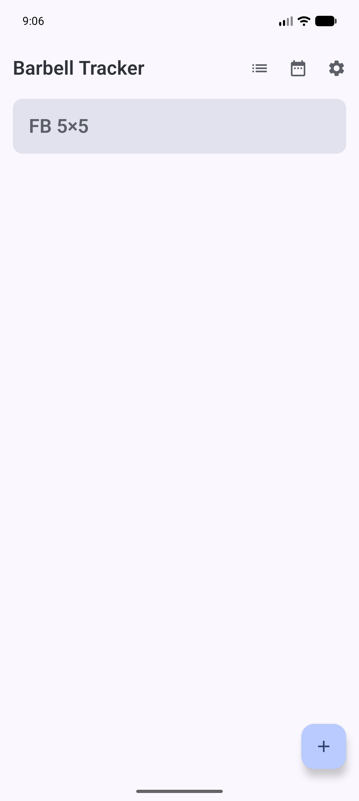
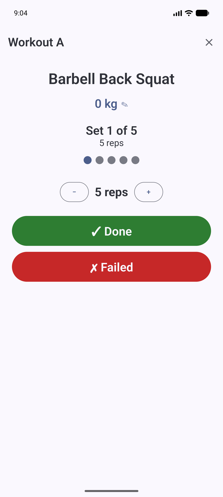
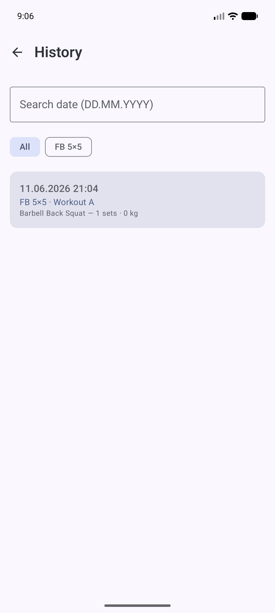
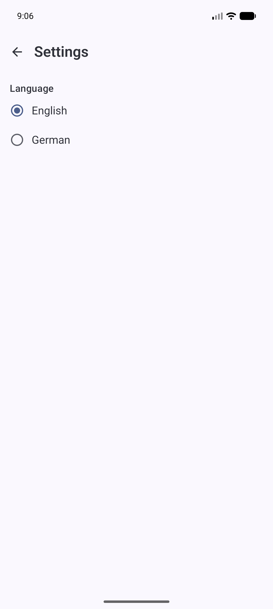

# Barbell Tracker

[](LICENSE)


A native Android app for structured **barbell strength training** — build a plan, run each
workout set by set with a rest timer, log your sets, and let the app suggest the next weight.
Fully offline. No login, no cloud, no ads, no tracking.

Available in **English and German**. Built from
[`spec/Barbell-Tracker-requirements.md`](spec/Barbell-Tracker-requirements.md).

## Features

- **Exercise library** — 11 predefined barbell exercises (squat, bench, deadlift, row, overhead
  press, …) with target muscles and form cues; add, edit, and delete your own.
- **Training plans** — start from a template (`5×5`, `3×8`, Stronglifts-style) or build your own;
  each plan holds multiple workouts (A / B / …) with per-exercise sets, reps, target weight, and rest.
- **Guided workout** — one exercise and set at a time: mark each set *done* or *failed* with
  editable actual reps, take a **rest timer** between sets, and confirm before moving to the next
  exercise. Pause, add rest, or end early at any point.
- **Automatic progression** — after a fully successful exercise, the app suggests **+2.5 kg** for
  next time (editable); on a miss it holds the weight.
- **Training diary** — every session is saved with date, plan, sets, reps and weights; filter by
  plan, search by date, and view a **weight-over-time chart** per exercise.
- **Bilingual** — English/German, switchable in-app; defaults to English on first launch.
- **Material 3** — dynamic color (Android 12+), dark mode, large readable workout type, haptics.
- **100% offline** — local Room database; the app requests no `INTERNET` permission.

## Screenshots

| Home | Workout | History | Settings |
|---|---|---|---|
|  |  |  |  |

## Tech stack

Kotlin · Jetpack Compose (Material 3) · Navigation-Compose · Room (KSP) · Hilt · Coroutines/Flow ·
MVVM + Repository. `minSdk 26`, `compileSdk 36`, `targetSdk 36`.

## Architecture

```
ui      Compose screens + ViewModels (no business logic)
  → data/repo   repository interfaces + impls   (swappable for a remote source later)
      → data/dao    Room DAOs
          → data/db     AppDatabase + first-launch seeder
domain  pure, unit-tested logic: RestDefaults, ProgressionCalculator, WorkoutEngine
di      Hilt modules
```

## Build & run

The Gradle daemon needs **JDK 17–21** (newer JDKs are not supported by AGP 8.7.3). Point Gradle at
one without committing a path — e.g. `export JAVA_HOME=/path/to/jdk-21`, or add
`org.gradle.java.home=…` to `~/.gradle/gradle.properties`. The SDK location comes from
`local.properties` (`sdk.dir=…`, gitignored — Android Studio generates it).

```bash
./gradlew :app:assembleDebug      # build the debug APK (offline once deps are cached)
./gradlew test                    # run the domain unit tests
./gradlew :app:installDebug       # install on a running emulator/device
```

**SDK note (Android 16 / API 36):** AGP 8.7.3 resolves `compileSdk = 36` to a platform with hash
`android-36`. If your SDK only ships the minor-versioned `android-36.1`, create a non-destructive
alias dir `platforms/android-36` (symlinks to `android-36.1` + a `source.properties`/`package.xml`
declaring `api-level 36`), or bump AGP to ≥ 8.9 which understands minor SDK versions.

## Localization

UI strings live in `res/values/strings.xml` (English, base) and `res/values-de/strings.xml`
(German). Switching uses AndroidX AppCompat per-app locales
(`AppCompatDelegate.setApplicationLocales`, persisted via `AppLocalesMetadataHolderService`).
English is forced once on first launch; the seeded exercise library is populated in the active
language at that point and is treated as editable user data afterwards.

## License

Released under the [MIT License](LICENSE). © 2026 ChrisOTM.

## Author

**ChrisOTM** — [github.com/chrisOTM](https://github.com/chrisOTM) ·
[barbell-tracker-android](https://github.com/chrisOTM/barbell-tracker-android)
